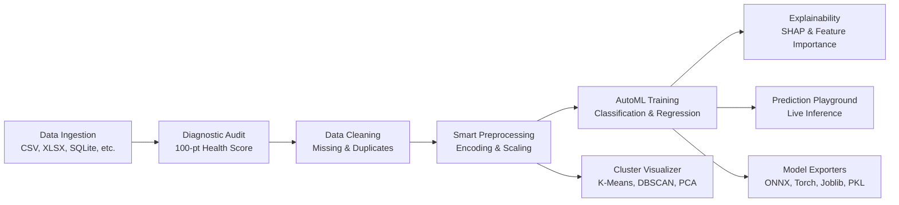

<!-- 🌌 MLFORGE HEADER -->
<p align="center">
  
</p>

<p align="center">
  <strong>Enterprise Automated Machine Learning & Experimentation Workspace</strong><br>
  <em>Build &bull; Train &bull; Evaluate &bull; Explain &bull; Deploy</em>
</p>

<p align="center">
  <a href="https://github.com/AlokRana01/MLForge-"></a>
  
  
  
  
</p>

---

## 🌟 Overview

**MLForge** is an enterprise-grade Automated Machine Learning (AutoML) platform and experimentation studio built for data scientists, machine learning engineers, and developers. It unifies the complete machine learning lifecycle into an intuitive, high-density SaaS interface:

* **Ingest & Profile**: Multi-format data loading and deterministic 100-point data quality diagnostics.
* **Clean & Transform**: Missing value imputation, deduplication, and automated feature encoding & scaling.
* **AutoML Engine**: Concurrent model training across classification and regression benchmarks with automated hyperparameter selection.
* **Unsupervised Clustering**: High-dimensional clustering with 2D/3D PCA projection and silhouette scoring.
* **Model Explainability**: SHAP and permutation importance analysis for model transparency.
* **Prediction Playground**: Interactive real-time parameter tweaking and model inference.
* **Multi-Format Export**: Production-ready model serializations (Pickle, Joblib, ONNX, TensorFlow, PyTorch).
* **Enterprise Design System**: Darkmatter Remix shadcn/ui aesthetic with local offline **Geist Sans** and **Geist Mono** typography.

---

## 🚀 Key Capabilities

### 1. Data Ingestion & Diagnostic Health Audit
- **Multi-Format Ingestion**: Load datasets seamlessly from CSV, Excel (`.xlsx`, `.xls`), JSON, XML, YAML, and SQLite (`.db`, `.sqlite3`).
- **Standard Benchmarks**: Instant 1-click loading of standard ML benchmarks (Iris, Wine, California Housing, Titanic, etc.).
- **Diagnostic Health Audit**: Deterministic 100-point ML Readiness Score evaluating missingness, outlier density, high-cardinality flags, class imbalance, and data leakage risks.

### 2. Intelligent Data Preparation
- **Missing Value Resolution**: Statistical imputation (Mean, Median, Mode, Constant), forward/backward propagation, and AI-recommended strategies.
- **Duplicate Records Studio**: Exact row matching and column-subset deduplication with interactive before/after impact previews.
- **Smart Preprocessing**: Categorical encoding (One-Hot, Ordinal, Label) and numeric scaling (StandardScaler, MinMaxScaler, RobustScaler) without target leakage.

### 3. Automated Model Training (AutoML)
- **Algorithm Suite**:
  - *Classification*: Logistic Regression, Random Forest, Decision Tree, Support Vector Classifier (SVC), K-Nearest Neighbors (KNN), Naive Bayes.
  - *Regression*: Linear Regression, Ridge, Lasso, ElasticNet, Random Forest Regressor, Gradient Boosting, Support Vector Regressor (SVR).
- **Leakage-Safe Validation**: Automated Train/Test splitting with optional stratified cross-validation.
- **Leaderboard Evaluation**: Side-by-side comparison with comprehensive metrics (Accuracy, F1-Score, Precision, Recall, ROC-AUC, R², MAE, RMSE, MAPE).

### 4. Interactive Clustering & Unsupervised Discovery
- **Clustering Algorithms**: K-Means with automatic elbow detection, DBSCAN with adaptive epsilon estimation, and Agglomerative Hierarchical Clustering.
- **Dimensionality Reduction**: Principal Component Analysis (PCA) projection for 2D/3D cluster boundary visualizations.
- **Cluster Diagnostics**: Silhouette coefficients, Davies-Bouldin indices, and cluster population breakdowns.

### 5. Model Explainability & Diagnostics
- **Permutation Importance**: Quantitative feature impact analysis on validation datasets.
- **SHAP Summary Visualizations**: Directional feature attribution plots showing positive/negative influence on predictions.
- **Decision Boundary Exploration**: Intuitive visual breakdown of model decisions.

### 6. Interactive Prediction Playground
- **Real-Time Inference**: Interactive form controls dynamically generated from dataset feature schemas.
- **Live Scoring**: Instant predictions with confidence probabilities and class distributions.
- **Sensitivity Testing**: Tweak individual numerical parameters to observe prediction boundaries in real time.

### 7. Multi-Format Model & Report Exporters
- **Production Serializations**: Export models directly to `.pkl`, `.joblib`, `.onnx` (cross-platform runtime), TensorFlow `.zip`, or PyTorch `.pt`.
- **Cleaned Data Export**: Export preprocessed datasets in CSV, Excel, JSON, XML, YAML, or SQLite.
- **Executive Audit Reports**: Generate exportable summaries of data quality, model performance, and pipeline configurations.

---

## 🎨 Design System, Branding & Typography

MLForge features a custom enterprise dark-theme design system (**Darkmatter Remix**):

### 🏷️ Brand Identity & Logo Suite
* **Signature Mark**: Isometric 3D Hexagonal Ribbon "M" with floating real-time data transformation pixels.
* **Palette Alignment**:
  * **Primary (Warm Copper)**: `#e78a53` — wordmark gradient, primary action controls, left pillar face.
  * **Secondary (Darkmatter Slate Teal)**: `#5f8787` / `#527575` — center crucible ribbon, technical telemetry.
  * **Luminous Peach**: `#fbcb97` — top isometric lid, spark pixels, gradient highlight.
  * **Terracotta**: `#9e4e24` — structural ribbon base anchor.
  * **Dark Canvas**: `#121113` — background viewport & squircle app icon base.
* **Asset Suite** (`assets/branding/`): Complete collection of high-resolution vector SVGs and raster PNGs:
  * Logos: `mlforge-logo-primary.svg`, `mlforge-logo-transparent.svg`, `mlforge-logo-dark.svg`, `mlforge-logo-light.svg`, `mlforge-logo-with-tagline.svg`, monochrome white/dark.
  * Icons: `mlforge-icon.svg`, `mlforge-app-icon.svg`, `mlforge-icon-dark.svg`, `mlforge-icon-light.svg`.
  * Favicons: 16px to 512px PNGs and multi-resolution Windows/Web `favicon.ico`.

### 🔤 Local Offline Typography
* **Geist Sans** (400, 500, 600, 700): Headings, sidebar brand, navigation items, buttons, form controls, cards, tables, and metric hierarchy.
* **Geist Mono** (400, 500, 600): Code blocks, technical telemetry, dataset statistics, and model parameters.
* **100% Offline**: Embedded locally via WOFF2 `@font-face` base64 rules in `modules/fonts.py`. Zero external CDNs or Google Fonts.

### ⚡ Startup Splash Screen
* GPU-accelerated isometric 3D ribbon brand entrance and animated progress fill bar.
* Session-state guarded: triggers once on startup and smoothly reveals the workspace.

---

## 🧠 Pipeline Architecture



---

## 📂 Repository Structure

```
MLForge/
├── .devcontainer/                  # Dev container configuration
├── .streamlit/
│   └── config.toml                 # Streamlit dark theme & server configuration
├── assets/
│   ├── branding/                   # Official brand marks, icons, and favicons
│   │   ├── logo/                   # SVG & PNG logos (primary, light, dark, transparent)
│   │   ├── icon/                   # App icons and stroke symbols
│   │   ├── favicon/                # Multi-resolution favicons and favicon.ico
│   │   └── BRAND_GUIDELINES.md     # Brand design specifications
│   └── fonts/                      # Local Geist Sans & Geist Mono WOFF2 webfonts
│       ├── Geist-*.woff2           # Geist Sans (Regular, Medium, SemiBold, Bold)
│       └── GeistMono-*.woff2       # Geist Mono (Regular, Medium, SemiBold, Bold)
├── modules/
│   ├── model_export/               # Serializers for ONNX, Torch, TF, Joblib, Pickle
│   │   ├── export_manager.py
│   │   ├── joblib_exporter.py
│   │   ├── onnx_exporter.py
│   │   ├── pickle_exporter.py
│   │   ├── tensorflow_exporter.py
│   │   └── torch_exporter.py
│   ├── ai_recommender.py           # Heuristic suggestions for cleaning & models
│   ├── automl.py                   # Model training, cross-validation & selection
│   ├── clustering.py               # K-Means, DBSCAN, Agglomerative & PCA
│   ├── data_audit.py               # 100-point diagnostic data readiness scoring
│   ├── duplicate_handler.py        # Duplicate detection & safe removal
│   ├── evaluation.py               # Metric calculation & confusion matrices
│   ├── explainability.py           # Permutation importance & SHAP summaries
│   ├── exporter.py                 # Multi-format tabular data exporter
│   ├── file_loader.py              # Universal file parser & benchmark loader
│   ├── fonts.py                    # Local @font-face base64 offline font engine
│   ├── missing_handler.py          # Missing value strategies & imputation
│   ├── prediction_playground.py    # Real-time model inference playground
│   ├── profiling.py                # Statistical column profiling
│   ├── splash_screen.py            # Startup splash screen & animation engine
│   └── ui_theme.py                 # Darkmatter Remix design tokens & CSS engine
├── scripts/
│   ├── generate_brand_assets.py    # Automation for brand rendering
│   └── test_ribbon_svg.py          # SVG verification utility
├── tests/                          # Pytest test suite (94+ passing unit tests)
│   ├── test_advanced_automl.py
│   ├── test_brand_assets.py
│   ├── test_data_audit.py
│   ├── test_explainability_and_playground.py
│   ├── test_leakage_and_cv.py
│   ├── test_pipeline_regression.py
│   ├── test_splash_screen.py
│   ├── test_typography.py
│   └── test_ui_ux_transformation.py
├── utils/
│   ├── helpers.py                  # Helper routines
│   └── icons.py                    # Icon definitions
├── app.py                          # Streamlit application entry point
├── requirements.txt                # Production dependencies
├── LICENSE                         # MIT License
└── README.md                       # Documentation
```

---

## ⚡ Quickstart

### Prerequisites
- Python 3.10, 3.11, 3.12, or 3.13
- Git

### 1. Clone the Repository
```bash
git clone https://github.com/AlokRana01/MLForge-.git
cd MLForge-
```

### 2. Set Up a Virtual Environment
```bash
# macOS/Linux
python3 -m venv venv
source venv/bin/activate

# Windows (PowerShell)
python -m venv venv
.\venv\Scripts\Activate.ps1
```

### 3. Install Dependencies
```bash
pip install -r requirements.txt
```

### 4. Launch the Application
```bash
streamlit run app.py
```

The application will launch on `http://localhost:8501`.

---

## 🧪 Testing & Verification

MLForge includes a comprehensive test suite covering data auditing, model export, typography, brand assets, UI/UX transformations, and pipeline regressions:

```bash
# Run all tests
python -m pytest

# Run specific test suites
python -m pytest tests/test_typography.py
python -m pytest tests/test_splash_screen.py
python -m pytest tests/test_ui_ux_transformation.py
```

---

## 📜 License

This project is open-source and distributed under the [MIT License](LICENSE).

---

## 👨‍💻 Author

**Alok Rana**  
* GitHub: [@AlokRana01](https://github.com/AlokRana01)  
* Repository: [https://github.com/AlokRana01/MLForge-.git](https://github.com/AlokRana01/MLForge-.git)

---

<p align="center">
  <sub>Built with passion for high-density, professional machine learning workflows.</sub>
</p>
